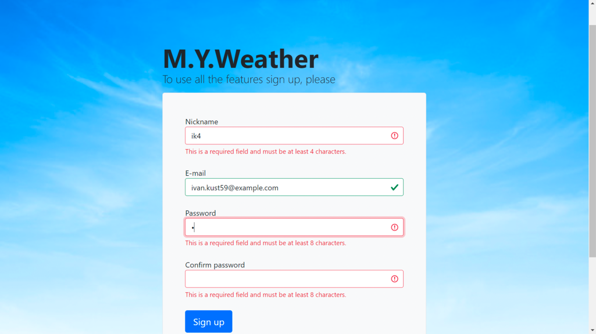

## Лабораторные работы №3 и №4 
Реализация серверной части приложения средствами Django и Django REST Framework и реализация клиентской части средствами фреймфорка Vue.js

### Функционал приложения
1. Регистрация пользователя;
2. Выбор городов пользователя по умолчанию;
3. Поиск по доступным городам из базы данных;
4. Изменение данных о пользователе и выбранных городах;
5. Фильтрация городов;

Костылев Иван, гр. К34401 (К33401)

## Описание разработки
### Серверная часть
1. Разработана база данных со следующими таблицами
   - пользователь
   - город
   - страна
2. Реализованы основные эндпоинты
   - регистрация
   - получение и обновление токена
   - изменение информации о пользователе
   - получение списка стран с пагинацией
   - получение списка городов с пагинацией
3. Реализована документация с помощью MkDocs
4. Добавлена документация по API (OpenAPI)

### Клиентская часть
1. Экран входа

2. Экран регистрации

3. Главная страница

4. Экран поиска

Для связи со мной можно использовать [Telegram](http://t.me/kostyleff)
